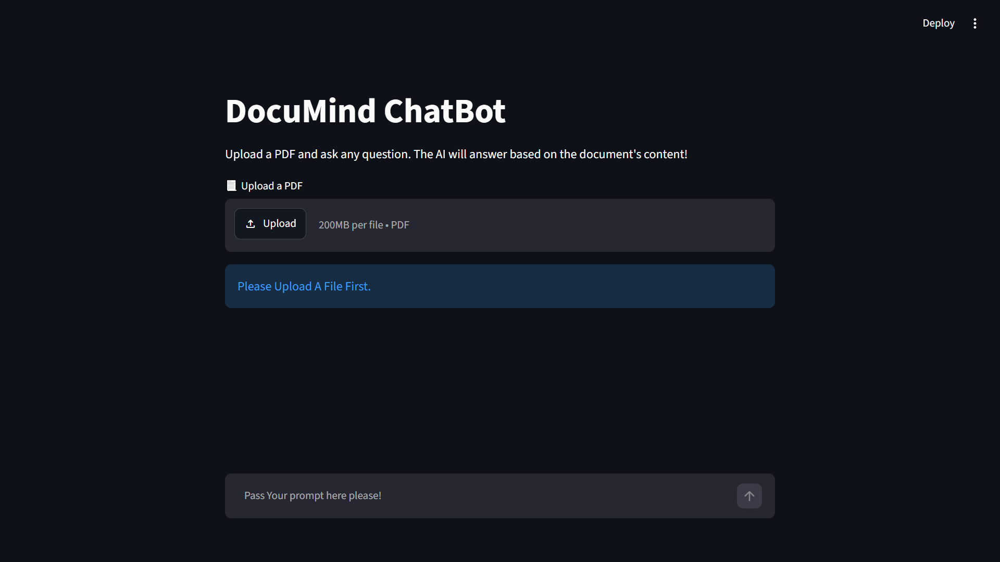

# DocuMind - AI PDF Chatbot

## 🚀 About The Project
DocuMind is an intelligent AI-powered assistant that allows users to upload PDF documents and ask questions about them. It uses **Retrieval-Augmented Generation (RAG)** to provide accurate, context-aware answers directly from your documents.

## 🛠️ Built With
- **Streamlit** - Frontend UI
- **LangChain** - Framework for LLM orchestration
- **Groq API** - High-speed LLM (Llama 3.3 70B versatile)
- **ChromaDB** - Vector Database for storing document chunks
- **HuggingFace Embeddings** - For converting text to numbers (all-MiniLM-L12-v2)

## ⚙️ How to Run Locally

1. Clone the repo
2. Install dependencies: `uv pip install -r requirements.txt`
3. Create a `.env` file with your `GROQ_API_KEY`
4. Run: `streamlit run app.py`

## 📷 Screenshots

## 🔗 Live Demo
[https://chatbot-rag-app-os7ucj4kkopfjappw2hxdff.streamlit.app/]
